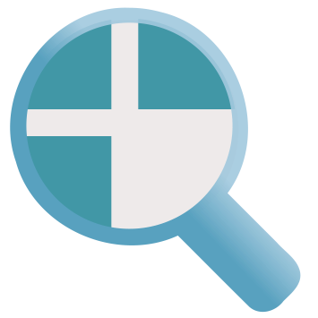

# dezoomify-extension

## What does it do ?
This project is a browser extension for detecting zoomable images in web pages and downloading them with [dezoomify](https://github.com/lovasoa/dezoomify).

Just [install the extension](#how-to-install), open a zoomable image in your browser,
click the blue magnifying glass icon in the address bar (),
and you'll be able to download the image.

 

## How to install
You can install this extension from your browser's official plugin market :
 - for Firefox, see [dezoomify on **Mozilla Addons**](https://addons.mozilla.org/en-US/firefox/addon/dezoomify/)
 - for Chrome, see [dezoomify on the **Chrome Web Store**](https://chrome.google.com/webstore/detail/dezoomify/iapjjopjejpelnfdonefbffahmcndfbm)

## How does it work ?

When you click on the addon's icon (the magnifying glass), it reloads the current page
while intercepting all network requests that match a certain pattern.

When request to what looks like a zoomable image is found,
it shows a little badge in your address bar, which you can click 
to download the image with dezoomify.

For more information about dezoomify, see: https://github.com/lovasoa/dezoomify

## Permissions

This browser addon requires the following permissions:

 - *Access browser activity during navigation* :
    needed to detect when you leave a webpage, so that the icon can be hidden and the older zoomable image information forgotten.

## Free Software
This addon is a free software (see [LICENSE](./LICENSE)).
You can see its source code at: https://github.com/lovasoa/dezoomify-extension/
